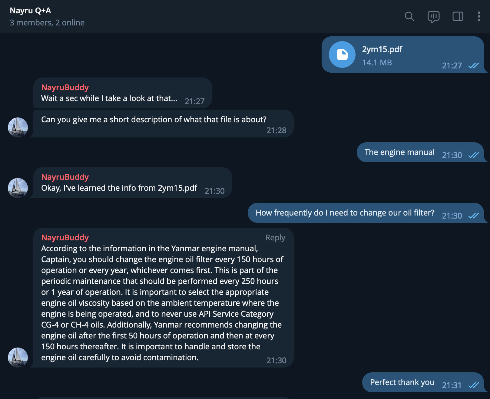
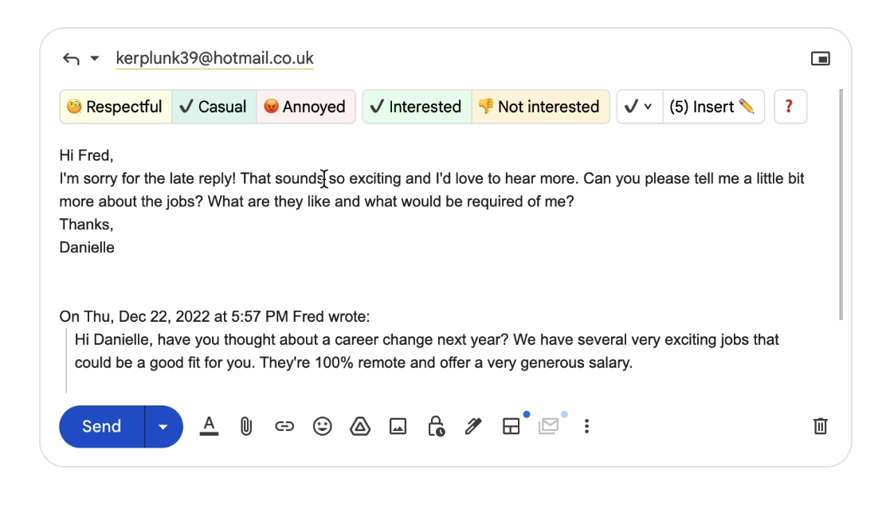

# Documentation Buddy

Documentation Buddy is a Telegram chatbot powered by GPT and OpenAI. You can upload PDF and other documents, the bot will learn from them and you can ask it questions.

Useful in a variety of situations where you have too much information to learn and need a quick reference guide!

### Requirements

- Your own OpenAI account and API Key
- A Pinecone account and API Key (for embeddings)
- Somewhere s3-like to save files (for re-indexing if needed)
- A Telegram key from BotFather

### Optional Requirements:

- If you don't use the DigitalOcean one-click deploy then you will also need to run OpenAIs embeddings project separately. You can get it from [here](https://github.com/openai/chatgpt-retrieval-plugin). If you do this then set the env variable `EMBEDDINGS_URL` to match. If you use the Deploy to DigitalOcean button below then this will be deployed for you as the `memory` component.
- A DigitalOcean account if you want to deploy directly to DigitalOceans App Platform. If you don't already have one, you can sign up [here](https://www.digitalocean.com/?refcode=1f67a87765d4).

## Getting Started

1. Create a new Telegram bot with BotFather. Step-by-step guide [here](https://core.telegram.org/bots/features#creating-a-new-bot).
2. You will get a token from BotFather that looks like this: `4839574812:AAFD39kkdpWt3ywyRZergyOLMaJhac60qc`. You will use this for the `TELEGRAM_TOKEN` env variable later.
3. Create a [Pinecone](https://www.pinecone.io/) account. This is used to store the embeddings data of the uploaded documents.
4. Get a Pinecone API key from the settings pages. You will use this for the `PINECONE_API_KEY` env variable. The index will be created automatically later so you don't need to do anything else.
5. Create a Digital Ocean Space (or other s3 like storage). This is used to store the documents uploaded in case they need to be reindexed later.
6. Click the button below to deploy directly as a Digital Ocean App. This is a simple step-by-step process that takes <5 minutes.
7. On the Environment Variables page of the Digital Ocean App creation process, replace the default values with the values you've generated.
8. The app should start automatically and connect to the Telegram API
9. Open a chat in Telegram with the bot you created, and try chatting to it!

## Deploying the App

Click this button to deploy the app to the DigitalOcean App Platform. If you are not logged in, you will be prompted to log in with your DigitalOcean account.

When you get to the "Review" section of the deploy, make sure to set the plan to `Basic` as it will default to `Pro`. The chat component should run fine on a $5/mo sized instance, and the memory component will probably be fine at $5 also, but much faster at $10/mo.

## Environment Variables

You'll need to add these to the DigitalOcean app env variables.

| Key                     | Default         | Description                                                                                         |
| ----------------------- | --------------- | --------------------------------------------------------------------------------------------------- |
| OPEN_AI_MODEL           | "gpt-3.5-turbo" | The AI model that the assistant will use to reply. GPT-3.5-Turbo will be good enough for most cases |
| OPEN_AI_KEY             |                 | Your OpenAI API Key                                                                                 |
| TELEGRAM_TOKEN          |                 | The token you get from BotFather                                                                    |
| BEARER_TOKEN |                 | Set this to a randomly generated string                                                             |
| STORAGE_NAME            |                 | The name of the s3 storage bucket eg. "doc-buddy"                                                   |
| STORAGE_URL             |                 | The url of the s3 bucket eg. https://sfo3.digitaloceanspaces.com/                                   |
| STORAGE_KEY             |                 | The API key of the s3 bucket                                                                        |
| STORAGE_SECRET          |                 | The Secret key of the s3 bucket                                                                     |
| DATASTORE               | pinecone        |                                                                                                     |
| PINECONE_API_KEY        |                 | Your Pinecone API key                                                                               |
| PINECONE_ENVIRONMENT    |                 | The envrinment of your Pinecone index eg. "northamerica-northeast1-gcp"                             |
| PINECONE_INDEX          |                 | The name of your Pinecone index eg. "doc-buddy-memory"                                              |

## Usage - uploading documentation

Simply upload a doc to the Telegram chat and doc buddy will learn the contents of that document.

## Customizing the assistant

You can edit the prompt that is given to the assistant in the `prompt.md` file.

## Sponsor

Sponsored by [Ellie - Your AI Email assistant](https://tryellie.com). Ellie learns from your writing style and crafts replies as if they were written by you!

